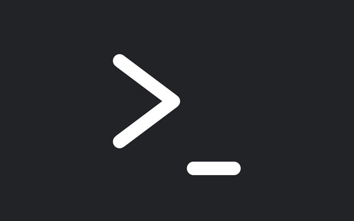

<h1 align="center">CLI-UPDATES</h1>

<h1 align="center">This is a simple project focused on developing a Command Line Interface</h1>

    

---------
## Description    

Buillding a simple **CLI** tool that takes user input **{a quote and color type}** and produces a drawing of a **ferris** with the chosen colour!

**CLI-UPDATES** is a project written in RUST programming language that grants the user access to a command line interface that takes user's input and in return draws an image using the chosen color parsed from the command line.

## Getting Started

Clone this repository and run `cargo build --release`

Run the code using `cargo run -q -- --quote "<your quote>" color`
or
`./target/release/cli-updates -q "<your quote>" color`

For more info Run `./target/release/cli-updates -h`

    

### AUTHOR
*Kelvin Maccarthy* - [@Captncarty](https://github.com/Captncarty)
